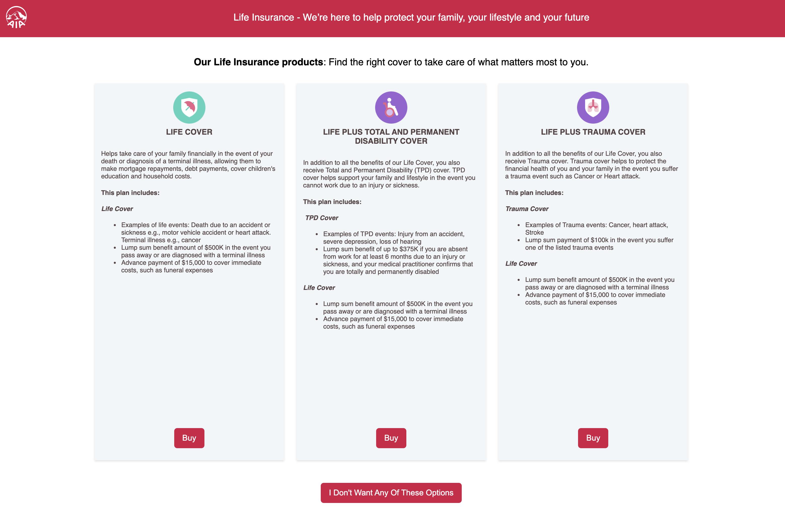

<div align="center">
  

# BeRapid - Front End



## The Future of Commercial Behavioural Experimentation - Today!

[](https://github.com/Decision-Technology/909-007-BehaviourLab-Rapid-FE/actions/workflows/development.yml)
[](https://codecov.io/gh/Decision-Technology/909-007-BehaviourLab-Rapid-FE)

[](https://github.com/facebook/react)
[](https://redux.js.org/)
[]()

[](http://commitizen.github.io/cz-cli/)
[](https://github.com/prettier/prettier)

</div>

The front end components and pages for BeRapid - the latest offering in the Dectech range of Behaviour Experiment products.
This project aims to create a data-driven experiment engine that is able to run a variety of environments which can be sold
to clients at a low cost.

## Environments

- **Product Cards** - mimics an online store with product selection and possible add-ons, before seeing a final checkout screen

## Features

- **Splash Screen** - Explain the user's journey with a splash screen consisting of four blocks of text or images
- **Storybook** - All components have documentation and demos with Storybook that is automatically uploaded to the Dectech website
- **Tested** - We are committed to a high degree of code coverage to ensure all components and logic works flawlessly
- **Ready for EFS** - The built projects are ready to upload to a suitable EFS survey
- **Data Driven** - The entire journey, including styling, is controlled by analyst-editable data files
- **Rapid Deployment** - The main aim of the project is to ensure creation of a new survey for a client is rapid and able to be turned around within 5 days

## Development

### Setup

Clone and install the requires packages using [Yarn]():

```sh
git clone git@github.com:Decision-Technology/909-007-BehaviourLab-Rapid-FE
yarn
```

### Committing

All commits should be done using [Commitizen](https://github.com/commitizen/cz-cli). The commits are linted to follow Conventional Commit standards, so it _will_ error if these aren't followed.

If Commitizen isn't installed yet, then it should be installed globally:

```sh
npm install commitizen -g
```

Commits can then be done via:

```sh
yarn cz
```

### Development Testing

Run the local server runtime using:

```sh
yarn start
```

### Testing

Testing is done using Jest, and should be ran in the background using:

```sh
yarn test
```

Code coverage can be obtained by running:

```sh
yarn test:coverage
```

### Linting

The code is linted using _eslint_ and _prettier_. The following commands should be ran automatically on every git commit, thanks to _husky_. However, if there are linting errors, try running the following commands:

```sh
yarn lint
yarn pretty
```

### Storybook

A Storybook for the components can be ran locally ([https://localhost:6006]) using the following command:

```sh
yarn storybook
```

A Storybook will automatically be created and uploaded to the Dectech website on any changes to the _main_ and _develop_ branches. These can be found at the following web addresses

[Dev - https://dectech.co.uk/storybooks/berapid/dev/index.html](https://dectech.co.uk/storybooks/berapid/dev/index.html)

[Production- https://dectech.co.uk/storybooks/berapid/release/index.html](https://dectech.co.uk/storybooks/berapid/release/index.html)

If you need to manually create a storybook build, then you can do this via:

```sh
yarn build-storybook
```

The resulting built can then be found in `/storybook-static/`

### Build for release

The project can be built using the following command:

```sh
yarn build
```

The resulting files with the `/build` directory should then be uploaded to a suitable EFS survey.
